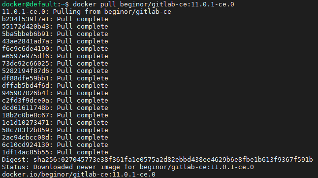

# Windows下docker安装Gitlab

## 安装docker

官网下载安装即可，安装完会有如图3个图标


## 安装虚拟机即docker

由于docker原生态是Linux，实际上在Windows下使用时会创建一个宿主机，即通过VirtualBox创建

第一次安装只要打开Docker Quickstart即可自动安装虚拟机，要注意的一点是默认安装路径在C盘，不做更改的话随着镜像、容器的使用会使C盘变得臃肿。所以可以在环境变量里添加MACHINE_STORAGE_PATH，路径为你想保存虚拟机的文件路径，再打开Docker Quickstart(没有虚拟机的情况下，如果有删除再重建)

## 安装Gitlab

建议虚拟机内存至少要在2g以上，不然容易出现访问502的情况

1. 下载镜像文件

   `docker pull gitlab/gitlab-ce:latest`可以访问阿里或清华镜像加速网获得最新的镜像地址

   

2. 创建GitLab的配置(etc)、日志(log)、数据(data)放到容器之外，便于日后升级

   ``` shell
   mkdir -p /mnt/gitlab/etc
   mkdir -p /mnt/gitlab/log
   mkdir -p /mnt/gitlab/data
   ```

   

3. 运行GitLab容器

   进入/mnt/gitlab/etc目录，运行：

   ```shell
   docker run \
     --detach \
     --hostname gitlab.hytek.com \
     --publish 9443:443 \
     --publish 9080:80 \
     --publish 9022:22 \
     --name Gitlab \
     --restart always \
     -v /mnt/gitlab/etc:/etc/gitlab \
     -v /mnt/gitlab/log:/var/log/gitlab \
     -v /mnt/gitlab/data:/var/opt/gitlab \
     gitlab/gitlab-ce:latest
   ```

   

4. 修改nginx配置文件

   ```nginx
   upstream gitlab{
       server 192.168.99.104:9080;
   }
   server {
       listen 80;
       server_name gitlab.hytek.com;
       access_log  logs/gitlab.hytek.com-acess.log;
       error_log   logs/gitlab.hytek.com-error.log;
       location / {
           proxy_pass_header Server;
           proxy_set_header Host $http_host;
           proxy_set_header X-Real-Ip $remote_addr;
           proxy_set_header X-Scheme $scheme;
           proxy_pass http://gitlab;
       }
   }
   ```

